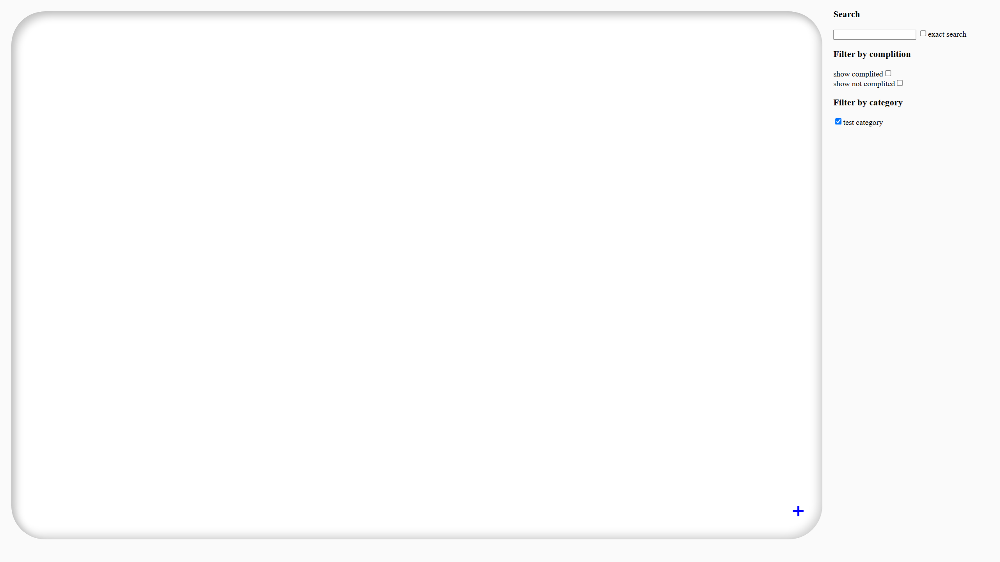

# taskLS

A minimalist to-do app made by me as a side project. So far it features categories, synchronization of all tasks between all devices, auto refreshing, advanced filtering options and more to come.

## table of contents
1. [Requirements](#requirements)
2. [Setup Guide](#Setup-Guide)
3. [Features](#features)

## Requirements
- server to host the website and database on
- PHP with MySQLi extension
- MariaDB (or other compatible database, I didn't test others)

## Setup Guide

1. Download and unzip the project into a directory from which it will be hosted by the server
2. Import the file `database.sql` as a new database with a name of your choice (will not be shown anywhere in the app)
3. Create a new file `session.php` and define the following variables inside: 
    - `$databaseHost` - IP address of the database, `127.0.0.1` if database is on the same server
    - `$databaseUsername` - name of the user that has access to your newly imported database
    - `$databasePassword` - password for said user
    - `$databaseName` - name of the imported database, that you chose
4. You should now be able to open the app

## Features

### Already done
- Synchronization of all tasks between all devices
- Auto refreshing every 10 seconds, no need to refresh manually
- Advanced text filtering options with highliting (more filtering options planned)
- Categories, which you can filter

### Planned
- Ability to send notifications about your tasks
- Periodic / Repeating tasks
- More filtering options
- Improve mobile interface